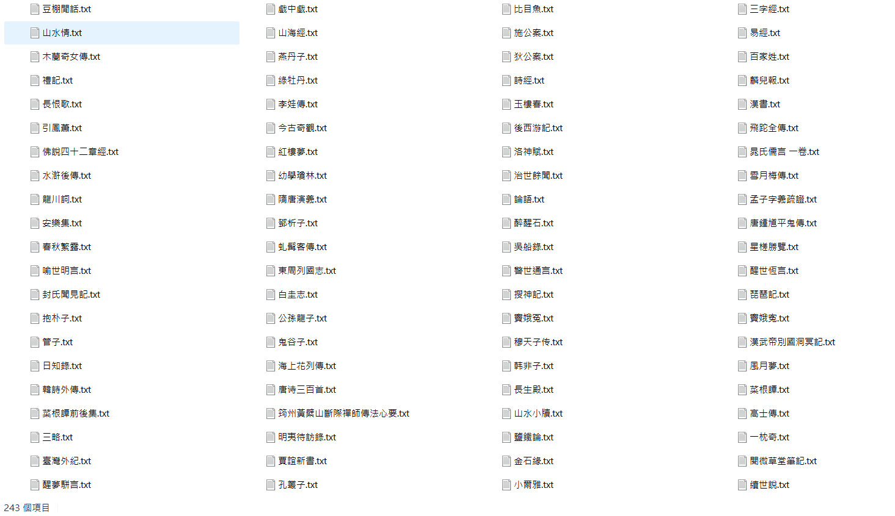
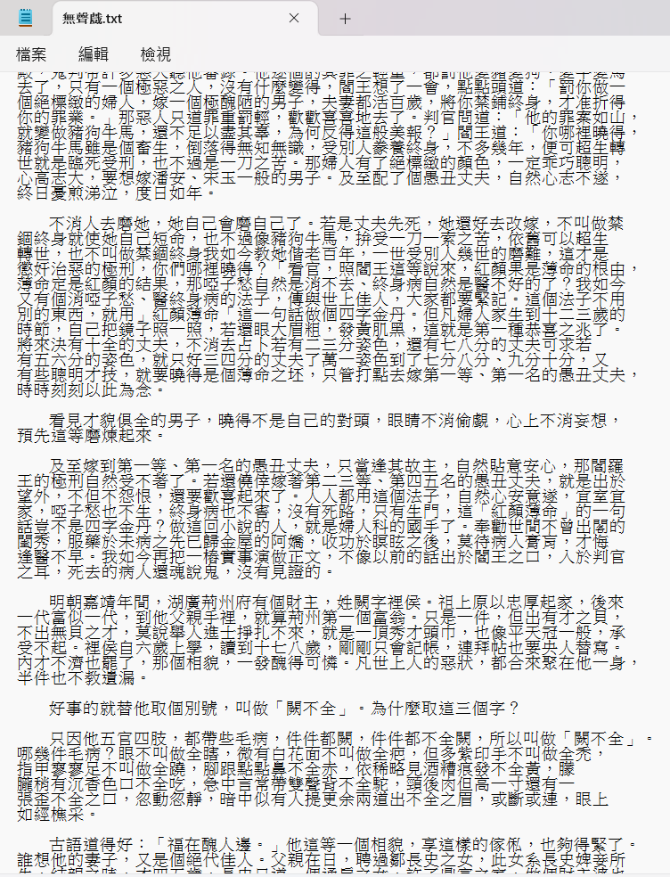

# Project Gutenberg
爬取中文書籍，標題與內文皆中文，可爬取 200 本以上。

## 安裝套件
- requests 2.32.3
- beautifulsoup4 4.13.4

## 成果

[古騰堡計劃-爬蟲練習作業](https://www.youtube.com/watch?v=7V6MTdDjtPY)

## 其它詳細說明
此程式透過requests與beautifulsoup4套件爬取古騰堡網站書籍，並透過正規表達式篩選出純中文標題並生成txt檔案至指定資料夾
